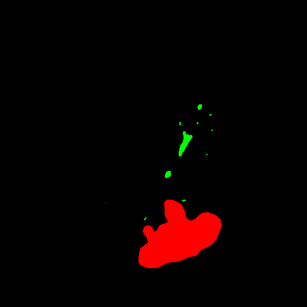
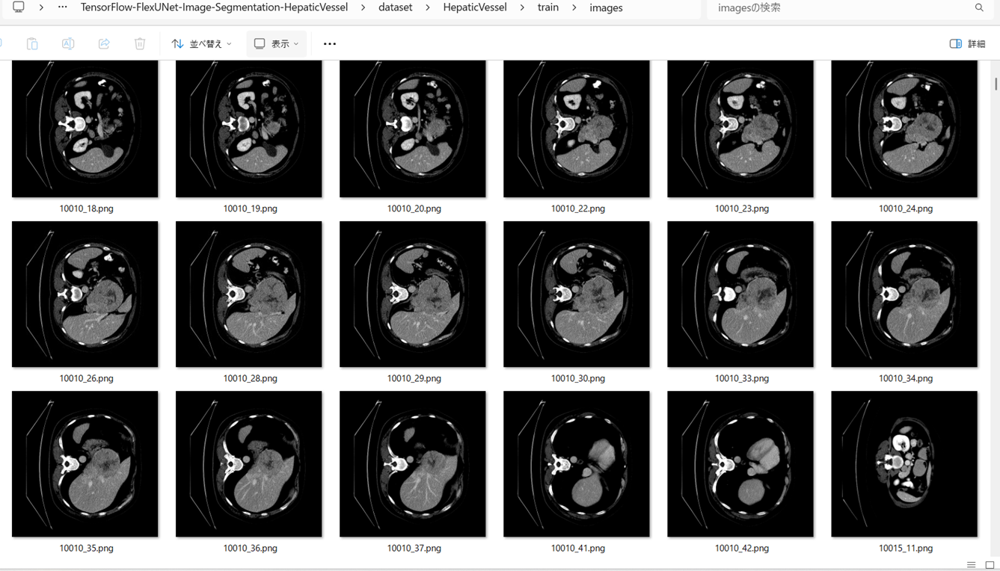
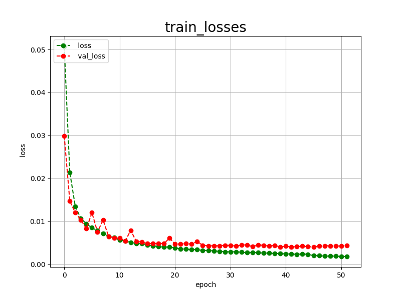
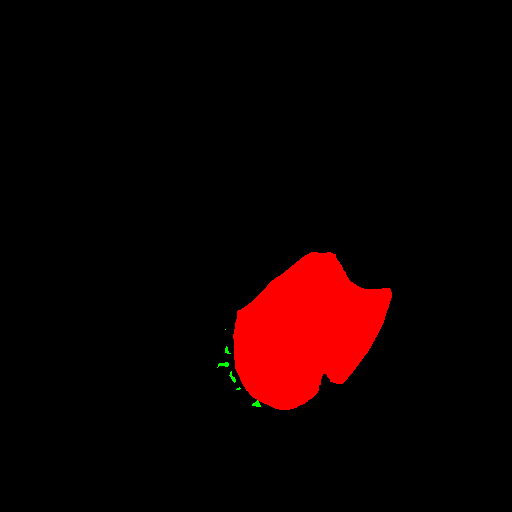
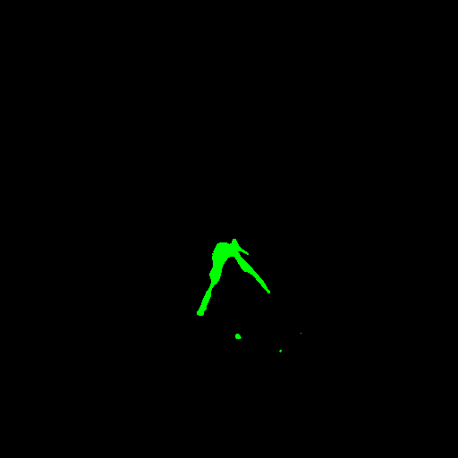

<h2>TensorFlow-FlexUNet-Image-Segmentation-HepaticVessel (2025/07/29)</h2>

This is the first preliminary experiment of Image Segmentation for HepaticVessel Multiclass (Vessel and Tumor) based on our TensorFlowFlexUNet (TensorFlow Flexible UNet Image Segmentation Model for Multiclass) and a 512x512 pixels 
<a href="https://drive.google.com/file/d/1r2f3wB13QY-1KMvkU-fZbYDFGKx_AHvc/view?usp=sharing">
HepaticVessel-ImageMask-Dataset.zip</a>.
which was derived by us from  
<a href="https://drive.google.com/file/d/1qVrpV7vmhIsUxFiH189LmAn0ALbAPrgS/view?usp=drive_link">
Task08_HepaticVessel.tar
</a>
on google drive <a href="https://drive.google.com/drive/folders/1HqEgzS8BV2c7xYNrZdEAnrHk7osJJ--2">
Medical Segmentation Decathlon (MSD)
</a>

 
 
<b>Acutual Image Segmentation for 512x512 HepaticVessel images</b> 
As shown below, the inferred masks look very similar to the ground truth masks. 
The green region represents a vessel, and the red a tumor respectively.  
<table>
<tr>
<th>Input: image</th>
<th>Mask (ground_truth)</th>
<th>Prediction: inferred_mask</th>
</tr>
<tr>
<td></td>
<td></td>
<td></td>
</tr>
<tr>
<td></td>
<td></td>
<td></td>

</tr>
<tr>
<td></td>
<td></td>
<td></td>
</tr>
</table>

 
<h3>1. Dataset Citation</h3>
The dataset used here has been taken from the following dataset: 
<a href="https://drive.google.com/file/d/1qVrpV7vmhIsUxFiH189LmAn0ALbAPrgS/view?usp=drive_link">
Task08_HepaticVessel.tar
</a>
on the google drive <a href="https://drive.google.com/drive/folders/1HqEgzS8BV2c7xYNrZdEAnrHk7osJJ--2">
Medical Segmentation Decathlon (MSD)
</a>
 

 
<b>License</b> 
<a href="https://creativecommons.org/licenses/by-sa/4.0/deed.en"
<b>CC-BY-SA 4.0</b>
</a>
 

All data will be made available online with a permissive copyright-license (CC-BY-SA 4.0),  
allowing for data to be shared, distributed and improved upon.  
All data has been labeled and verified by an expert human rater, and with the best effort to  
mimic the accuracy required for clinical use.  
To cite this data, please refer to 
<a href="https://arxiv.org/abs/1902.09063">https://arxiv.org/abs/1902.09063
</a>
 
<h3>
<a id="2">
2 HepaticVessel ImageMask Dataset
</a>
</h3>
 If you would like to train this HepaticVessel Segmentation model by yourself,
 please download the dataset from the google drive  
<a href="https://drive.google.com/file/d/1r2f3wB13QY-1KMvkU-fZbYDFGKx_AHvc/view?usp=sharing">
HepaticVessel-ImageMask-Dataset.zip</a>.
 
, expand the downloaded ImageMaskDataset and put it under <b>./dataset</b> folder to be
<pre>
./dataset
└─HepaticVessel
    ├─test
    │   ├─images
    │   └─masks
    ├─train
    │   ├─images
    │   └─masks
    └─valid
        ├─images
        └─masks
</pre>
 
<b>HepaticVessel Statistics</b> 
 
 
On the derivation of the dataset, please refer to our repository 
<a href="https://github.com/sarah-antillia/Image-Segmentation-Liver-Tumor">Image-Segmentation-Liver-Tumor</a>
  
<!--
On the derivation of the dataset, please refer to the following Python scripts: 
<li><a href="./generator/ImageMaskDatasetGenerator.py">ImageMaskDatasetGenerator.py</a></li>
<li><a href="./generator/split_master.py">split_master.py</a></li>
 
-->
As shown above, the number of images of train and valid datasets is large enough to use for a training set of our segmentation model.
 
 
<b>Train_images_sample</b> 

 
<b>Train_masks_sample</b> 

 
<h3>
3 Train TensorFlowFlexUNet Model
</h3>
 We trained HepaticVessel TensorFlowFlexUNet Model by using the following
<a href="./projects/TensorFlowFlexUNet/HepaticVessel/train_eval_infer.config"> <b>train_eval_infer.config</b></a> file.  
Please move to ./projects/TensorFlowFlexUNet/HepaticVessel and run the following bat file. 
<pre>
>1.train.bat
</pre>
, which simply runs the following command. 
<pre>
>python ../../../src/TensorFlowFlexUNetTrainer.py ./train_eval_infer.config
</pre>

<b>Model parameters</b> 
Defined a small <b>base_filters = 16 </b> and large <b>base_kernels = (9,9)</b> for the first Conv Layer of Encoder Block of 
<a href="./src/TensorFlowFlexUNet.py">TensorFlowFlexUNet.py</a> 
and a large num_layers (including a bridge between Encoder and Decoder Blocks).
<pre>
[model]
;You may specify your own UNet class derived from our TensorFlowFlexModel
model         = "TensorFlowFlexUNet"
generator     =  False
image_width    = 512
image_height   = 512
image_channels = 3
num_classes    = 3

base_filters   = 16
base_kernels   = (9,9)
num_layers     = 8
dropout_rate   = 0.04
dilation       = (1,1)
</pre>
<b>Learning rate</b> 
Defined a very small learning rate.  
<pre>
[model]
learning_rate  = 0.00005
</pre>
<b>Loss and metrics functions</b> 
Specified "categorical_crossentropy" and <a href="./src/dice_coef_multiclass.py">"dice_coef_multiclass"</a>. 
<pre>
[model]
loss           = "categorical_crossentropy"
metrics        = ["dice_coef_multiclass"]
</pre>
<b>Dataset class</b> 
Specifed <a href="./src/ImageCategorizedMaskDataset.py">ImageCategorizedMaskDataset</a> class. 
<pre>
[dataset]
class_name    = "ImageCategorizedMaskDataset"
</pre>
 
<b>Learning rate reducer callback</b> 
Enabled learing_rate_reducer callback, and a small reducer_patience.
<pre> 
[train]
learning_rate_reducer = True
reducer_factor     = 0.5
reducer_patience   = 4
</pre>
<b>Early stopping callback</b> 
Enabled early stopping callback with patience parameter.
<pre>
[train]
patience      = 10
</pre>

<b>RGB Color map</b> 
rgb color map dict for HepaticVessel 1+2 classes. 
<pre>
[mask]
mask_file_format = ".png"
; background   black  vessel:green, tumor:red
rgb_map = {(0,0,0):0, (0,255,0):1, (255,0,0):2,}
</pre>

<b>Epoch change inference callback</b> 
Enabled <a href="./src/EpochChangeInfereuncer.py">epoch_change_infer callback</a></b>. 
<pre>
[train]
epoch_change_infer       = True
epoch_change_infer_dir   =  "./epoch_change_infer"
num_infer_images         = 6
</pre>

By using this callback, on every epoch_change, the inference procedure can be called
 for 6 images in <b>mini_test</b> folder. This will help you confirm how the predicted mask changes 
 at each epoch during your training process.    

<b>Epoch_change_inference output at starting (epoch 1,2,3)</b> 
 
 
<b>Epoch_change_inference output at middlepoint (epoch 7,8,9)</b> 
 
 
<b>Epoch_change_inference output at ending (epoch 16,17,18)</b> 
 
 
In this experiment, the training process was terminated at epoch 18.  
 
 

<a href="./projects/TensorFlowFlexUNet/HepaticVessel/eval/train_metrics.csv">train_metrics.csv</a> 
 

 
<a href="./projects/TensorFlowFlexUNet/HepaticVessel/eval/train_losses.csv">train_losses.csv</a> 
 

 

<h3>
4 Evaluation
</h3>
Please move to <b>./projects/TensorFlowFlexUNet/HepaticVessel</b> folder, 
and run the following bat file to evaluate TensorFlowFlexUNet model for HepaticVessel. 
<pre>
./2.evaluate.bat
</pre>
This bat file simply runs the following command.
<pre>
python ../../../src/TensorFlowFlexUNetEvaluator.py ./train_eval_infer_aug.config
</pre>

Evaluation console output: 

  

<a href="./projects/TensorFlowFlexUNet/HepaticVessel/evaluation.csv">evaluation.csv</a> 
The loss (categorical_crossentropy) to this HepaticVessel/test was very low and dice_coef_multiclass 
very high as shown below.
 
<pre>
categorical_crossentropy,0.0057
dice_coef_multiclass,0.997
</pre>
 

<h3>
5 Inference
</h3>
Please move <b>./projects/TensorFlowFlexUNet/HepaticVessel</b> folder 
,and run the following bat file to infer segmentation regions for images by the Trained-TensorFlowFlexUNet model for HepaticVessel. 
<pre>
./3.infer.bat
</pre>
This simply runs the following command.
<pre>
python ../../../src/TensorFlowFlexUNetInferencer.py ./train_eval_infer_aug.config
</pre>

<b>mini_test_images</b> 
 
<b>mini_test_mask(ground_truth)</b> 
 

<b>Inferred test masks</b> 
 
 

<b>Enlarged images and masks of 512x512 pixels</b> 

<table>
<tr>
<th>Image</th>
<th>Mask (ground_truth)</th>
<th>Inferred-mask</th>
</tr>

<tr>
<td></td>
<td></td>
<td></td>
</tr>

<tr>
<td></td>
<td></td>
<td></td>
</tr>

<tr>
<td></td>
<td></td>
<td></td>
</tr>

<tr>
<td></td>
<td></td>
<td></td>
</tr>

<tr>
<td></td>
<td></td>
<td></td>
</tr>

<tr>
<td></td>
<td></td>
<td></td>
</tr>
</table>

 
<h3>
References
</h3>
<b>1.Medical Segmentation Decathlon Generalisable 3D Semantic Segmentation</b> 
<a href="http://medicaldecathlon.com/">http://medicaldecathlon.com/</a>
 
 
<b>2. MSD Hepatic Vessel</b> 
OpenMEDLab 
<a href="https://github.com/openmedlab/Awesome-Medical-Dataset/blob/main/resources/MSD_Hepatic_Vessel.md">
MSD Hepatic Vessel
</a>
 
 
<b>3. A large annotated medical image dataset for the 
development and evaluation of segmentation algorithms</b> 
Amber L. Simpson, Michela Antonelli, Spyridon Bakas, Michel Bilello, Keyvan Farahani, Bram van Ginneken,  
Annette Kopp-Schneider, Bennett A. Landman, Geert Litjens, Bjoern Menze, Olaf Ronneberger, Ronald M. Summers, 
 Patrick Bilic, Patrick F. Christ, Richard K. G. Do, Marc Gollub, Jennifer Golia-Pernicka, Stephan H. Heckers, 
  William R. Jarnagin, Maureen K. McHugo, Sandy Napel, Eugene Vorontsov, Lena Maier-Hein, M. Jorge Cardoso 
<a href="https://arxiv.org/pdf/1902.09063">https://arxiv.org/pdf/1902.09063</a>

 
 
<b>4. Hepatic vessels segmentation using deep learning and preprocessing enhancement</b> 
Omar Ibrahim Alirr, Ashrani Aizzuddin Abd Rahni 
<a href="https://aapm.onlinelibrary.wiley.com/doi/10.1002/acm2.13966">https://aapm.onlinelibrary.wiley.com/doi/10.1002/acm2.13966</a>
